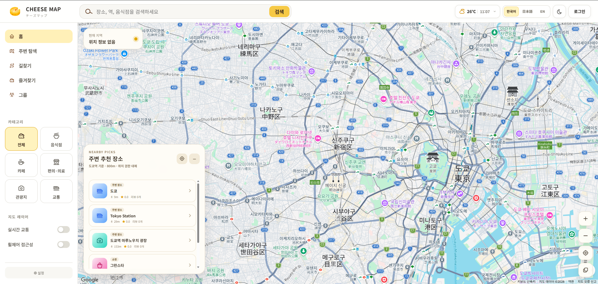
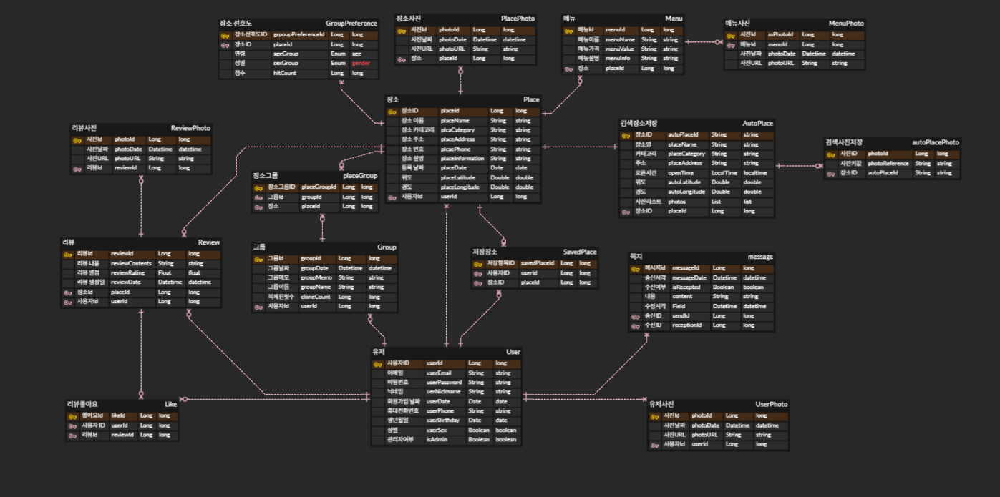

# 🧀 치즈맵 (Cheezemap)

<br>

## ❇️ [프로젝트 개요](https://github.com/JaehyenFanclub/cheezemap)

### 개발 기간 및 인원

- 26.07.08 - 26.09.08(2달)
- 5인 개발(프론트 2, 백엔드 3)

### 프로젝트 소개
**치즈맵(Cheezemap)** 은 지도 위에서 원하는 장소를 탐색하고, 관심 장소를 그룹으로 모아 공유할 수 있는 위치 기반 웹 서비스입니다.  
서비스명은 일본어로 지도를 의미하는 **地図(ちず, Chizu)** 와 **Cheese** 의 발음이 비슷한 점에서 착안해 지었습니다.

설계 단계에서는 단순한 장소 검색 서비스를 넘어 **개인화된 장소 추천**과 **사용자 간의 경험 공유**에 중점을 두었습니다. 사용자의 좋아요·즐겨찾기·리뷰·그룹 활동과 연령·성별 등의 사용자 세그먼트 데이터를 활용해 개인의 취향에 맞는 주변 장소를 추천하고, 그룹과 리뷰, 메시지 기능을 통해 함께 방문할 장소를 계획하고 경험을 공유할 수 있도록 구성했습니다.

관심 있는 장소를 저장하고 그룹으로 공유하는 것부터 리뷰와 메시지를 통한 사용자 간 소통, 개인화된 장소 추천, 대중교통 경로 탐색 및 번역 기능까지 하나의 서비스 흐름으로 연결하여 장소 탐색부터 방문 계획과 경험 공유까지 지원하도록 구현했습니다.

- [ERD](https://www.erdcloud.com/d/g47ek3tiHtyLd5HNY)
- [API 명세서](https://app.notion.com/p/be6fac4c960783bb85188138d1710d4c?v=3e1fac4c9607837c83250868f457399a)
- [프로젝트 링크](https://cheezemap.life)
</br>

## 👨‍👩‍👧‍👦 팀원 소개

| <div align="center">김태일<br>[GitHub](https://github.com/)</div><div align="center"> 공통<br>저장소 운영<br>PR 리뷰·머지<br>협업<br>브랜치 관리<br>인증/인가<br>JWT·회원관리·Blacklist 로그아웃<br>Google/Naver/LINE OAuth2 통합<br>장소 수집<br>Google Places API(New) 연동·다단계 Fallback·AutoPlace<br>장소 관리<br>외부 Google ID·내부 placeId 분리·Stripe Lock 동시성 제어<br>메뉴<br>Place 종속 메뉴 CRUD·이미지 Multipart 업로드<br>리뷰<br>CRUD·이미지·좋아요 / 추천 데이터 연동<br>추천<br>행동·세그먼트·통계 기반 개인화 랭킹<br>경로<br>NAVITIME 대중교통 API Backend Proxy<br>인프라<br>Docker·GHCR·GitHub Actions CI/CD</div> | <div align="center">엄용민<br>[GitHub](https://github.com/)</div> | <div align="center">전태성<br>[GitHub](https://github.com/)</div> | <div align="center">한규원<br>[akaneblue](https://github.com/akaneblue)</div>                                                                                                                                                                                                                                                                                                     | <div align="center">한재헌<br>[GitHub](https://github.com/)</div> |
| :---------------------------------------------------------------------------- | :---------------------------------------------------------------------------- | :---------------------------------------------------------------------------- |:----------------------------------------------------------------------------------------------------------------------------------------------------------------------------------------------------------------------------------------------------------------------------------------------------------------------------------------------------------------------------------| :---------------------------------------------------------------------------- |
| <div align="center"></div> | <div align="center"></div> | <div align="center"></div> | <div align="center"></div>                                                                                                                                                                                                                                                                                                                | <div align="center"></div> |
| <div align="center"></div> | <div align="center"></div> | <div align="center"></div> | <div align="center"> `공통`<br>저장소 운영<br>PR 리뷰·머지<br>`협업`<br>브랜치 관리<br>`인증/인가`<br>JWT·회원관리·Blacklist 로그아웃<br>Google/Naver/LINE OAuth2 통합<br>`리뷰`<br>CRUD·이미지·좋아요 / 추천 데이터 연동<br>`추천`<br>행동·세그먼트·통계 기반 개인화 랭킹<br>`경로`<br>NAVITIME 대중교통 API Backend Proxy<br>`인프라`<br>Docker·GHCR·GitHub Actions CI/CD</div> | <div align="center"></div> |

## 🚀 기술 스택

Category | Stack
--- | --- |
Language | 
IDE | 
Framework | 
Build Tool | 
Database | 
Library |     
API |      
Frontend |  
Infra |   
Tools |  

<details>
<summary><strong>📣기술 & 라이브러리 선정 이유</strong></summary>
<div markdown="1">
  <br/>
  <details>
  <summary><strong> 1️⃣ Spring Boot 4.1.0</strong></summary>
    <div markdown="1">

    1. 스타터 의존성으로 웹·보안·JPA를 빠르게 구성할 수 있습니다.
    2. 내장 서버로 별도의 WAS 없이 `Chizu` 모듈을 바로 실행할 수 있습니다.
    3. Spring Security OAuth2 Client와 JWT 필터를 함께 쓰기 좋습니다.
    4. springdoc-openapi로 Swagger UI를 바로 붙일 수 있습니다.

  </details>

  <details>
  <summary><strong> 2️⃣ MySQL</strong></summary>
    <div markdown="1">

    1. 장소·리뷰·그룹 등 관계형 데이터가 많아 RDB가 적합합니다.
    2. 로컬에서 `cheezemap_db`를 바로 띄워 개발할 수 있습니다.
    3. JPA `ddl-auto=update`로 엔티티와 스키마를 맞춰가며 개발합니다.
    4. 테스트는 H2를 런타임으로 둘 수 있게 구성해 두었습니다.

  </details>

  <details>
  <summary><strong> 3️⃣ JWT & Spring Security & OAuth2</strong></summary>
    <div markdown="1">

    1. 로컬 회원가입/로그인은 JWT 헤더 인증으로 Stateless하게 처리합니다.
    2. Google, Naver, LINE 소셜 로그인을 Spring Security OAuth2 Client로 연동합니다.
    3. 로그아웃 시 토큰 블랙리스트로 재사용을 막습니다.
    4. API와 정적 프론트(지도 화면)를 같은 서버에서 제공할 수 있습니다.

  </details>

  <details>
  <summary><strong> 4️⃣ Google Maps & Places API</strong></summary>
    <div markdown="1">

    1. 커스텀 마커 대신 Google 기본 POI를 사용해 지도 UX를 유지합니다.
    2. 카테고리별 Cloud Map ID로 음식점/카페/의료/관광/교통 POI를 필터링합니다.
    3. Places API(New)로 장소 상세·사진을 가져와 `AutoPlace`에 캐시합니다.
    4. Place ID가 바뀌는 경우 Text Search로 재조회하는 fallback이 있습니다.

  </details>

  <details>
  <summary><strong> 5️⃣ springdoc-openapi</strong></summary>
    <div markdown="1">

    1. 컨트롤러 어노테이션만으로 API 문서를 생성합니다.
    2. `/swagger-ui.html`에서 인증·장소·그룹 API를 바로 호출할 수 있습니다.
    3. 프론트와 백엔드가 같은 저장소에 있어 계약 확인이 쉽습니다.

  </details>

  <details>
  <summary><strong> 6️⃣ 정적 프론트 (HTML/JS)</strong></summary>
    <div markdown="1">

    1. Spring이 `static/`의 지도 UI를 바로 서빙합니다.
    2. 회원가입·프로필 수정 페이지를 별도 SPA 없이 제공합니다.
    3. 지도 클릭 → 장소 카드 → 그룹/리뷰 흐름을 한 화면에서 처리합니다.

  </details>

  <details>
  <summary><strong> 7️⃣ Docker & GitHub Actions</strong></summary>
    <div markdown="1">

    1. JDK 17 Multi-stage 빌드로 이미지 크기를 줄이고 Non-root(`spring`)로 실행합니다.
    2. Compose로 MySQL 8.4 + 앱을 묶고 healthcheck로 기동 순서를 맞춥니다.
    3. 로컬은 `docker-compose.yml`(build), 운영은 `docker-compose.prod.yml`(GHCR pull)로 분리합니다.
    4. `main` Push 시 Buildx로 이미지 빌드·푸시하고, `workflow_dispatch`로 SSH 수동 배포합니다.

  </details>

  <details>
  <summary><strong> 8️⃣ NAVITIME & Translation API</strong></summary>
    <div markdown="1">

    1. RapidAPI NAVITIME TotalNavi를 Backend Proxy로 호출해 API Key를 프론트에 노출하지 않습니다.
    2. Google Cloud Translation으로 리뷰 텍스트를 ko/ja/en으로 번역합니다.

  </details>

</div>
</details>
</br>

## 📁 아키텍처
```
Cheezemap/
├── .github/workflows/deploy.yml    # GHCR 빌드·푸시 + SSH 수동 배포
├── docker-compose.yml              # 로컬: MySQL + 앱 빌드
├── docker-compose.prod.yml         # 운영: GHCR 이미지 pull
├── Chizu/                          # Gradle Spring Boot 모듈 (여기가 실제 앱)
│   ├── Dockerfile                  # Multi-stage (JDK build / JRE run)
│   ├── build.gradle
│   ├── src/main/java/org/example/
│   │   ├── auth/                   # 소셜 로그인 (Google / Naver / LINE)
│   │   ├── user/                   # 회원가입, JWT 로그인, 마이페이지
│   │   ├── place/                  # 장소 CRUD, 좋아요·즐겨찾기, 선호도, 주변 추천
│   │   ├── autoPlace/              # Google Places 연동·캐시
│   │   ├── menu/                   # 장소별 메뉴·메뉴 사진
│   │   ├── group/                  # 그룹 CRUD, 공유, 복제
│   │   ├── placeGroup/             # 그룹-장소 매핑
│   │   ├── review/                 # 리뷰·사진·좋아요
│   │   ├── message/                # 1:1 메시지
│   │   ├── route/                  # NAVITIME 대중교통 경로 Proxy
│   │   ├── translate/              # Google Translate 리뷰 번역
│   │   ├── config/                 # Security, JWT, OpenAPI
│   │   └── exception/
│   └── src/main/resources/static/  # CHEESE MAP 지도 UI
└── uploads/                        # 리뷰/유저 이미지 저장
```

```
요청 흐름:
- 브라우저 → 정적 지도 UI (Google Maps JS)
- REST API → JWT 헤더 또는 OAuth2 콜백
- Google Places API → AutoPlace 저장 후 Place와 연결
- 추천 API → 반경 내 장소를 평점·리뷰 수·연령/성별 히트로 정렬
- 경로 API → Backend Proxy → RapidAPI NAVITIME
- 번역 API → Google Cloud Translation (ko / ja / en)
```

<br>

## 📊 ERD 설계


### 테이블 구조 (엔티티 기준)
<details>
<summary><strong>상세 테이블 구조</strong></summary>

#### 👤 유저 관련
- 유저 (`users`) — 로컬/소셜 계정, 생년월일·성별, Soft Delete
- 유저 사진 (`UserPhoto`)

#### 📍 장소 관련
- 장소 (`place`) — 좌표, 카테고리, Google Place ID, 평점 집계
- 장소 사진 (`PlacePhoto`)
- 장소 좋아요 (`PlaceLike`)
- 장소 즐겨찾기 (`PlaceSaved`)
- 장소 선호도 (`place_preference`) — 연령대·성별 세그먼트 hit
- 자동 수집 장소 (`autoPlace`) — Google Places 캐시
- 자동 수집 사진 (`AutoPlacePhoto`)

#### 🍽️ 메뉴 관련
- 메뉴 (`menu`)
- 메뉴 사진 (`MenuPhoto`)

#### 📁 그룹 관련
- 그룹 (`table_group`) — `group`은 SQL 예약어라 테이블명 변경
- 그룹-장소 (`PlaceGroup`)

#### ⭐ 리뷰 관련
- 리뷰 (`reviews`)
- 리뷰 사진 (`ReviewPhoto`)
- 리뷰 좋아요 (`ReviewLike`)

#### 💬 메시지 관련
- 메시지 (`Message`) — 송신/수신, 읽음, 수정 여부

</details>

<br>

## 🌐 API 설계
- Swagger UI: [https://cheezemap.life/swagger-ui.html](https://cheezemap.life/swagger-ui.html)

### 도메인 구성
```
✅ 인증/인가: 로컬 회원가입·로그인, JWT, 토큰 블랙리스트 로그아웃
✅ 소셜 로그인: Google / Naver / LINE OAuth2 (+ Google People API 프로필 보강)
✅ 장소: 등록/수정/삭제, 사진, 좋아요·즐겨찾기, 클릭 선호도 기록
✅ 추천: 현재 위치 반경 내 평점·리뷰·세그먼트 히트 가중 정렬 (Top 20)
✅ Google Places: Place ID로 상세 조회·사진 프록시, 로컬 캐시
✅ 메뉴: 장소별 메뉴 CRUD 및 사진
✅ 그룹: 생성/수정/삭제, 장소 추가, 공유, 복제
✅ 리뷰: 작성/수정/삭제, 사진, 좋아요 토글, 별점→선호도(`+5~-5`), 사용자 리뷰 최신순 조회
✅ 메시지: 송수신, 수정/삭제, 미읽음 개수, 닉네임 검색
✅ 유저: 마이페이지 조회/수정, 프로필 사진, Soft Delete 탈퇴
✅ 경로: NAVITIME 대중교통 경로 Backend Proxy (`GET /api/route/transit`)
✅ 번역: Google Translate 리뷰, 쪽지 번역 (`POST /api/translate`)
```

<br>

##  🛠 주요 기능
```
🔐 인증: 회원가입 | JWT 로그인 | Blacklist 로그아웃 | Google/Naver/LINE
👤 유저: 마이페이지 | 프로필 사진 | 비밀번호 변경 | Soft Delete 탈퇴 | 내 리뷰
🗺️ 지도: Google 기본 POI | 카테고리 Map ID 필터 | 장소 클릭 카드
📍 장소: 등록 | 수정 | 삭제 | 사진 | 좋아요 | 즐겨찾기 | 선호도(hit)
🎯 추천: 반경 검색 | 평점 Shrinkage | 리뷰 Log 가중 | 세그먼트 hit 0.6
🍽️ 메뉴: 등록 | 수정 | 삭제 | 사진
📁 그룹: 생성 | 공유 | 복제 | 그룹에 장소 담기
⭐ 리뷰: 작성 | 사진 | 좋아요 | 장소 평점·리뷰 수 갱신 | 별점→선호도 `+5~-5`
💬 메시지: 1:1 채팅 | 미읽음 알림
🚇 경로: NAVITIME 대중교통 (최대 5개, time_optimized)
🌐 번역: 리뷰, 쪽지 텍스트 ko / ja / en
🐳 인프라: Docker Compose | GHCR | GitHub Actions CI/CD
```

<details>
  <summary><strong>1️⃣ JWT 인증/인가 & 소셜 로그인</strong></summary>
  <br>

- [x] 로컬 회원가입/로그인 후 JWT 발급 (BCrypt 비밀번호)
- [x] 이메일·닉네임·전화번호 중복 검증
- [x] 요청 헤더 기반 JWT 필터
- [x] 로그아웃 시 토큰 블랙리스트
- [x] Google / Naver / LINE OAuth2 → 서비스 JWT 통합 발급
- [x] 기존 로컬 계정과 소셜 계정 연결
- [x] Google People API로 생일·성별·전화번호 보강
- [x] Soft Delete 기반 회원 탈퇴
- [x] 소셜 제공자 목록 API (`/user/auth/oauth2/providers`)
</details>

<details>
  <summary><strong>2️⃣ 지도 & Google Places</strong></summary>
  <br>

- [x] Google Maps JS로 일본 리전 지도 표시
- [x] 음식점/카페/편의·의료/관광/교통 카테고리별 Map ID 전환
- [x] POI 클릭 시 Places API로 상세 조회
- [x] `AutoPlace` 캐시 및 사진 미디어 URL 프록시
</details>

<details>
  <summary><strong>3️⃣ 주변 장소 추천</strong></summary>
  <br>

- [x] Haversine 거리로 반경 내 후보 수집 (최대 100개 → Top 20)
- [x] 평점 Shrinkage(베이지안 prior) + 리뷰 수 Log 가중 + 연령/성별 hit
- [x] 기본 가중치: 평점 0.2, 리뷰 0.2, 세그먼트 hit 0.6
- [x] 행동별 선호도 누적 — 좋아요 `+2`, 즐겨찾기 `+3`, 그룹 추가 `+5`, 리뷰 별점 `-5~+5`
- [x] 성별 기반 추천 API (`/place/recommend/gender`)
</details>

<details>
  <summary><strong>4️⃣ 그룹</strong></summary>
  <br>

- [x] 내 그룹 생성/조회/수정/삭제
- [x] 그룹에 장소 추가·삭제 (추가 시 선호도 `+5`)
- [x] 그룹 공유
- [x] 그룹 복제(clone)
</details>

<details>
  <summary><strong>5️⃣ 리뷰 & 메시지</strong></summary>
  <br>

- [x] 장소별 리뷰 CRUD 및 Multipart 이미지 업로드
- [x] 리뷰 수정 시 이미지 추가·선택 삭제
- [x] 리뷰 좋아요 토글
- [x] 리뷰 변경에 따른 장소 평점·리뷰 수 갱신
- [x] 리뷰 별점에 따른 장소 선호도 반영 (`1~5점 → -5~+5`)
  - 1점 `-5` / 2점 `-3` / 3점 `+1` / 4점 `+3` / 5점 `+5`
- [x] 사용자 작성 리뷰 최신순 조회 (`/user/me/reviews`)
- [x] 사용자 간 메시지 송수신
- [x] 미읽음 개수 조회, 닉네임으로 상대 찾기
</details>

<details>
  <summary><strong>6️⃣ 장소 좋아요·즐겨찾기</strong></summary>
  <br>

- [x] 장소 좋아요 토글 (`/api/places/{placeId}/like`)
- [x] 장소 즐겨찾기 저장 (`/api/places/{placeId}/save`)
- [x] 내 좋아요·즐겨찾기 목록 조회
</details>

<details>
  <summary><strong>7️⃣ 대중교통 경로 & 번역</strong></summary>
  <br>

- [x] `GET /api/route/transit` — NAVITIME TotalNavi Backend Proxy
- [x] 출발·도착 좌표 검증, 출발 시간 미지정 시 도쿄 현지 시간
- [x] `shape` / `time_optimized` 등 옵션 서버 관리, 최대 5개 경로
- [x] API Key 백엔드 관리 (프론트 미노출)
- [x] `POST /api/translate` — Google Translate (ko / ja / en)
</details>

<br>

## ⭐ CI/CD

Docker 기반 개발·운영 환경과 GitHub Actions CI/CD를 구성했습니다.

**배포 흐름**

`main Push → Docker Image Build → GHCR Push`

`수동 배포(workflow_dispatch) → SSH 접속 → 최신 Image Pull → Docker Compose 재배포`

<details>
  <summary><strong> Docker / Compose</strong></summary>
    <div markdown="1">

- JDK 17 Multi-stage Dockerfile — 빌드(JDK) / 실행(JRE) 분리
- Non-root(`spring`) 사용자로 애플리케이션 실행
- `docker-compose.yml` — 로컬 빌드 + MySQL 8.4
- `docker-compose.prod.yml` — GHCR 이미지 pull + MySQL 8.4
- MySQL healthcheck 기반 기동 순서 제어
- named volume으로 DB·업로드 파일 영속화
- GitHub Secrets로 DB·JWT·OAuth·NAVITIME 등 환경변수 주입

  </details>

<details>
  <summary><strong> GitHub Actions</strong></summary>
    <div markdown="1">

- `.github/workflows/deploy.yml`
- Buildx + GHA cache로 Docker Image Build & Push
- 태그: branch / sha / latest
- `workflow_dispatch` + SSH(`appleboy/ssh-action`)로 운영 서버 수동 배포

  </details>

<details>
  <summary><strong> 로컬 실행</strong></summary>
    <div markdown="1">
      <h3>Gradle 모듈은 루트가 아니라 <code>Chizu/</code> 입니다</h3>

      ```bash
      # Docker Compose (권장)
      # .env에 DB·JWT·OAuth·Google·NAVITIME 키 설정 후
      docker compose up --build

      # 또는 Gradle 직접 실행
      # 1) MySQL에 cheezemap_db 준비
      # 2) .env / application.properties에 키 설정
      cd Chizu
      ./gradlew bootRun
      ```

      <p>✅ 앱: <code>http://localhost:8080</code></p>
      <p>✅ Swagger: <code>http://localhost:8080/swagger-ui.html</code></p>
      <p>✅ 운영 Swagger: <a href="https://cheezemap.life/swagger-ui.html">https://cheezemap.life/swagger-ui.html</a></p>
      <p>✅ IntelliJ에서는 <code>Chizu</code> 폴더를 Gradle 프로젝트로 열어야 의존성이 잡힙니다</p>
</details>

</br>

## 🐞 Trouble Shooting

<details>
  <summary><strong>1️⃣ OAuth2 제공자별 사용자 정보 차이로 인한 회원가입 실패</strong></summary>
    <div markdown="1">

**문제 상황**

Google, Naver, LINE 등 소셜 로그인 제공자마다 반환하는 사용자 정보와 제공 범위에 차이가 존재하여, 로컬 회원가입에서 필수값으로 설정한 일부 정보가 OAuth2 인증 과정에서 전달되지 않는 문제 발생.

**원인**

OAuth2 제공자별로 이름, 전화번호 등의 사용자 프로필 제공 여부와 반환 필드가 상이하여 모든 필수 회원정보를 인증 단계에서 확보하기 어려운 구조.

**해결**

소셜 로그인으로 최초 회원 생성 시 바로 회원가입을 완료하지 않고 **추가 정보 입력 단계**를 거치도록 인증 흐름 수정.

- OAuth2 인증 → 기본 프로필 정보 확보
- 필수 정보가 부족한 경우 추가 정보 입력창으로 이동
- 사용자가 부족한 정보를 입력한 후 최종 회원 생성
- 이후 서비스 내부에서는 로컬 회원과 동일한 사용자 정보 구조로 관리

**결과**

소셜 제공자의 사용자 정보 차이에 관계없이 **일관된 회원가입 프로세스 확보** 및 필수 회원정보 누락 문제 해결.

  </details>

<details>
  <summary><strong>2️⃣ 회원 탈퇴 시 연관 데이터로 인한 삭제 실패</strong></summary>
    <div markdown="1">

**문제 상황**

회원 탈퇴 시 리뷰, 그룹 등의 다른 데이터와 회원 정보가 연관되어 있어 회원 레코드를 실제로 삭제할 경우 **외래키 제약 조건으로 인해 삭제가 실패하는 문제 발생**.

**원인**

사용자 데이터가 여러 도메인과 연결되어 있어 물리 삭제 시 연관된 데이터를 함께 삭제하거나 참조 관계를 모두 정리해야 하는 구조.

**해결**

회원 삭제 방식을 **물리 삭제(Hard Delete)에서 논리 삭제(Soft Delete) 방식으로 변경**.

- 회원 데이터에 `deleted` 상태값 추가
- 탈퇴 시 회원 레코드는 유지하고 `deleted = true` 처리
- 개인정보는 랜덤 UUID 기반의 값으로 치환하여 기존 개인정보 제거
- 이메일·전화번호 등 UNIQUE 제약이 존재하는 필드는 더 이상 사용되지 않는 값으로 변경
- 삭제된 계정은 일반 로그인 및 서비스 이용 대상에서 제외

**결과**

연관 데이터의 외래키 제약을 유지하면서도 회원 탈퇴 처리 가능.

또한 탈퇴한 계정의 개인정보를 제거하고, **동일 이메일·전화번호로 재가입하는 경우에도 UNIQUE 제약 충돌이 발생하지 않도록 처리**.

  </details>

<details>
  <summary><strong>3️⃣ GitHub Container Registry (GHCR) 이미지 태그 대소문자 오류 및 배포 실패</strong></summary>
    <div markdown="1">

**문제 상황**

GitHub Actions를 통한 CI/CD 배포 중 `docker pull` 과정에서 `unable to get image ... invalid reference format: repository name ... must be lowercase` 에러가 발생하며 배포가 실패함.

**원인**

Docker의 명세 규칙상 이미지 및 레포지토리 이름은 오직 소문자(Lowercase)만 허용함. 하지만 GitHub Organization/User 이름(`JaehyenFanclub`)에 대문자가 포함되어 있어, `${{ github.repository }}` 변수를 그대로 태그로 사용할 경우 Docker 규격 위반이 발생함.

**해결**

CI/CD 파이프라인(Workflow) 내에서 Docker 이미지를 빌드 및 푸시하기 전, GitHub 레포지토리명을 강제로 소문자로 변환하는 로직을 추가함.

- Workflow 실행 시 `${GITHUB_REPOSITORY}` 환경변수 값을 소문자로 변환
- 변환된 소문자 변수(`REPO_LOWER`)를 활용해 GHCR 이미지 태그(`ghcr.io/${{ env.REPO_LOWER }}:main`) 지정 및 빌드/푸시 수행

**결과**

GHCR 이미지 경로가 `ghcr.io/jaehyenfanclub/cheezemap:main`과 같이 소문자로 정상 변환되어 이미지 푸시 및 EC2에서의 `docker pull` 배포 작업이 에러 없이 동작함. 또한 차후 대소문자가 섞인 레포지토리명을 사용하더라도 배포가 안정적으로 유지되도록 구조 개선.

  </details>
